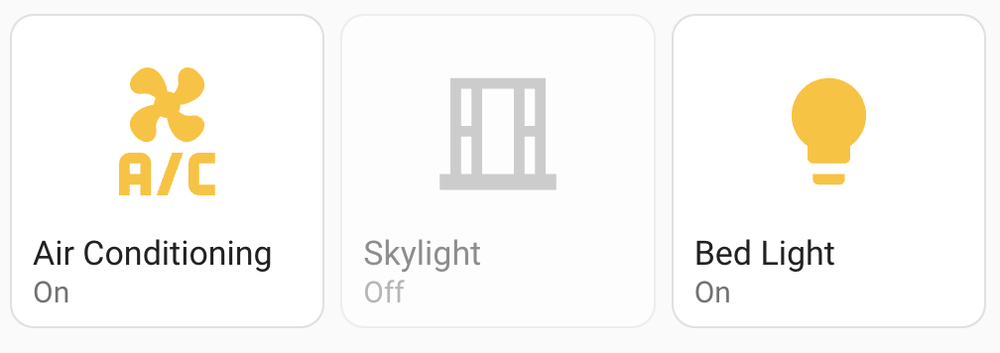

[](https://ko-fi.com/flixlix)


A simple Custom Card for Home Assistant to toggle switches, lights &amp; more!
This card focuses on ease of configuration and stability.

To use this card, it is highly recommended to place it inside a grid or stack in order to achieve the sizing to which this card is optimized for.

## Features

- Stability! 🦾
- Clean Design (Fits well with HA design-language) ✨
- Ui Editor 🚀
- Custom Dialog with configurable cards ⚡️

## Installation

0. Before starting, make sure, advanced mode is enabled in your user profile (click on your user avatar in the sidebar to enable it). Also make sure you have [HACS](https://hacs.xyz) installed.
1. Navigate to HACS
2. Go to "Frontend"
3. Click the ⠇button in the top right corner and select "Custom Repositories"
4. Copy this Repo's link (`https://github.com/flixlix/homekit-button`)
5. Under "Category", select "Frontend"
6. The card should now be found and able to be easily installed through the UI 🥳

## Configuration

To start using this card, you can simply create a new Card in your Lovelace dashboard and select "HomeKit Button" in the card type picker.

This card features an (almost) fully functional UI Editor, so in most cases you won't need to edit any YAML.

The following options are available from the YAML configuration.

| Option | Default | Required | Description | 
|---|--|-|----|
| `entity` | undefined | ✅ | The main entity to be displayed. |
| `name` | Name of the entity |  | The name to be shown for the card. |
| `icon` | Icon of the entity |  | The icon to be shown in the card. |
| `show_state` | true |  | Wether to show the "On" / "Off" Labels in the card. |
| `active_color` | var(--state-light-on-color) | | A css recognisable color (HEX, Color Name or variable) to change the icon to when the entity is in its active state. |
| `tap_action` | more-info |  | The action to call when tapping the card. See [Action Object](#action-object) for more info. |
| `hold_action` | more-info |  | The action to call when holding the card. See [Action Object](#action-object) for more info. |
| `double_tap_action` | more-info |  | The action to call when double-tapping the card. See [Action Object](#action-object) for more info. |
| `title` | none |  | The title to show above the card (not recommended). |


## Example

This code:

```yaml
type: grid
cards:
  - type: custom:homekit-button
    entity: switch.ac
  - type: custom:homekit-button
    entity: switch.skylight
  - type: custom:homekit-button
    entity: light.bed_light
```

Should give you something like this:


